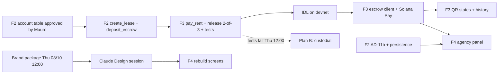

# PLAN.md — Tuki

Status: **F0 approved by Mauro on Sat 2026-10-03.** F2–F7 replanned the same night for his real availability and the approved cuts; their detailed boards are completed on Sunday (F1-05).

Current phase: **F0 — in progress**.

Legend: **[U]** = long task that can run unattended while Mauro teaches. It still ends in a review by Mauro before merging.

---

## 1. Phase table

| Phase | Dates (ART) | Goal | Dev agents | Agent-hours | Mauro-hours | Exit gate |
|---|---|---|---|---|---|---|
| **F0** Recordable demo | Sat 03/10 21:30 → Sun 04/10 01:00 | Vertical slice end to end with real devnet transactions, recordable in 3 min | fullstack, ai-agents, solana-client, ui-motion, submission-writer, qa | ~6 | 3.5 | Public URL up; Ana/Bruno/Carla correct 3/3; 2 devnet txs with Memo; Verify green; video recorded; `docs/reviews/phase-0.md` = GO |
| **F1** Pre-selection + Demo Day | Sun 04/10 09:00 → 15:30 | Form submitted with pitch and demo videos | submission-writer, market-validation, ui-motion, qa | ~4 | 3 (+ Ani) | Form sent before 15:30; compliance checklist GO |
| **F2** Foundations | Mon 05/10 → Tue 06/10 | Neon persistence, roles, real document extraction, first two program instructions | fullstack, ai-agents, solana-program, market-validation, qa | 10–12 | 5 | AD-11b live; uploads extracted; prompt-injection eval passes; `create_lease` + `deposit_escrow` tests pass |
| **F3** On-chain core (highest risk) | Tue 06/10 → Thu 08/10 | Anchor escrow on devnet, Solana Pay QR with Phantom, on-chain history | solana-program, solana-client, ai-agents, ui-motion, qa | 14–16 | 7 | All mandatory program tests pass; program on devnet; `ESCROW_MODE=program` works e2e. **Plan B: Thu 08/10 12:00, freeze `custodial`** |
| **F4** Product + brand | Fri 09/10 → Sat 10/10 (morning) | Brand applied, minimal agency panel | ui-motion, fullstack, submission-writer, qa | 6–7 | 5 (1.5 of them with Ani) | 4 key screens match mockups, light/dark, 375 px; agency panel shows the NEEDS_INFO queue and releases a deposit |
| **F5** Market validation (cross-cutting) | Mon 05/10 → Sat 10/10 | Verifiable evidence | market-validation | ~3 | 1 (Ani 6–8) | `docs/validation/evidence.md` holds only real entries; target ≥ 1 LOI or pilot |
| **F6** Hardening | Sat 10/10 (afternoon) | Full e2e, security, compliance | qa + owners of blocking issues | ~5 | 4 | e2e 3/3 from first message to deposit release; Colosseum Copilot feedback addressed |
| **F7** Freeze + submission | Sun 11/10 → Mon 12/10 | Both submissions sent | submission-writer, qa | ~4 | 7 + 3.5 (with Ani) | **Freeze Sun 11/10 20:00.** Earn + Colosseum sent Mon 12/10 before 18:00 |

Mauro's budget for F2–F7: 3.5 h × 6 weekdays + 7 h × 2 weekend days = **35 h**. Planned above: 32.5 h, leaving 2.5 h of slack. This only fits with the approved cuts: no embedded wallet (Phantom via Solana Pay QR only), AD-13 and AD-14 out, minimal agency panel.

---

## 2. Task boards

### F0 — detailed

Times are minutes of agent work. `T` is the moment Mauro says "OK F0" (target 21:30).

| ID | Task | Owner | Est. | Depends on | Paths | Acceptance |
|---|---|---|---|---|---|---|
| F0-00 | Create empty GitHub repo `tuki-rentals`, link Vercel project, have `ANTHROPIC_API_KEY` at hand | **Mauro** | 10 | — | — | Remote URL and Vercel project exist |
| F0-01 | Scaffold: Next.js App Router + TS strict + Tailwind v4 + Framer Motion + zod, pnpm. Install **all** F0 dependencies in this step so no other agent touches `package.json` (`@anthropic-ai/sdk`, `@solana/web3.js@1`, `@solana/spl-token`, `tsx`, `vitest`). `.gitignore`, `.env.example`, root layout with banner "Demo · Solana devnet · simulated data", first commit, tag `v0-hackathon-start`, empty deploy | fullstack-engineer | 20 | F0-00 | `app/layout.tsx`, `package.json`, `.env.example`, `.gitignore`, config | `pnpm build` passes; Vercel URL shows the banner; tag exists |
| F0-02 | Shared contracts as types only (§4 of this plan) | lead | 10 | F0-01 | `lib/contracts.ts` | Compiles; the four parallel agents import from it |
| F0-03a | `scripts/setup-devnet.ts` step 1: generate keypairs (platform/custody, landlord, agency, 3 tenants), print the platform address, stop if balance is 0 | solana-client-engineer | 10 | F0-01 | `scripts/` | Address printed; Mauro requests SOL at faucet.solana.com |
| F0-03b | Step 2 (idempotent): mint `tUSDC` (6 decimals), token accounts, fund tenants. `lib/solana/{connection,transfer,hash,explorer}.ts`, `lib/rules/pricing.ts`, `POST /api/pay`. Platform wallet is the fee payer for every tx, so only one wallet needs SOL | solana-client-engineer | 65 | F0-02, F0-03a + faucet | `lib/solana/**`, `lib/rules/pricing.ts`, `scripts/**`, `app/api/pay/**` | Script reruns cleanly; `/api/pay` returns `PaymentResult`; unit tests for the 4 discount cases and hash pass; Memo visible in explorer |
| F0-04 | Provider wrapper, orchestrator with stage machine, listings, prequal, crosscheck, lease (English template + sha256), `lib/rules/{prequal,names}.ts`, simulated docs for Ana/Bruno/Carla, `REPLAY=1`, eval of the 3 cases | ai-agents-engineer | 90 | F0-02 | `lib/agents/**`, `lib/rules/**` (not `pricing.ts`), `lib/ai/**`, `seed/docs/**`, `seed/tenants.json`, `evals/**` | Eval: Ana=APPROVED, Bruno=NEEDS_INFO(`expired_payslip`), Carla=NEEDS_INFO via crosscheck(`name_mismatch`), 3/3 runs, live and in replay |
| F0-05 | Chat + animated Lease timeline, prequal cards, two-price payment screen, contract view with Verify, neutral tokens. Built against `lib/contracts.ts` with fixtures until the routes exist | ui-motion-engineer | 90 | F0-02 | `components/**`, `app/page.tsx`, `styles/tokens.css`, `lib/motion/**` | Works at 375 px, light and dark; no hex outside `tokens.css`; the word "blockchain" is absent |
| F0-06 | `seed/properties.json` (10 properties, real Salta zones, 250–700 USDC), `POST /api/chat`, `POST /api/lease`, `POST /api/verify`, session handling (see risk R0-4) | fullstack-engineer | 40 | F0-02 | `app/api/{chat,lease,verify}/route.ts`, `seed/properties.json`, `lib/db/**` | Bodies validated with zod; routes return the contract types |
| F0-07 | `README.md` v0 (problem, how to run, what is simulated, **custodial** escrow stated, Disclosures, Security considerations) + `docs/submission/demo-script.md` | submission-writer | 30 | F0-01 | `README.md`, `docs/submission/**` | English; no invented traction; escrow mode stated |
| F0-08 | Integration: wire UI to routes, set Vercel env vars, `pnpm build`, evals, production deploy | lead | 30 | F0-03b…F0-06 | glue only | Public URL runs the full flow |
| F0-09 | Gate: full flow 3 times in a row, secrets scan, PII-in-Memo check | qa-security-reviewer | 20 | F0-08 | `tests/e2e/**`, `docs/reviews/phase-0.md` | GO, or a list of blocking issues |
| F0-10 | Record the demo (≤ 3 min, English) following `demo-script.md` | **Mauro** | 30 | F0-09 | — | Video uploaded |

Out of scope for F0: Anchor, scannable QR, embedded wallet, database, real visits agent.

### F1 — Sun 04/10 09:00 → 15:30

| ID | Task | Owner | Est. | Depends on |
|---|---|---|---|---|
| F1-01 | `docs/submission/preselection.md`: every form field with character counts; `pitch-script.md` (2 min) | submission-writer | 90 | F0 |
| F1-02 | GTM and validation text (honest, plan instead of traction); list of 15 Salta agencies to contact | market-validation-analyst | 60 | — |
| F1-03 | Visual fixes found while recording | ui-motion-engineer | 60 | F0-10 |
| F1-04 | Compliance checklist: English, repo access for `hackathon@superteam.ar`, Disclosures | qa-security-reviewer | 20 | F1-01, F1-03 |
| F1-05 | Complete the detailed boards for F2–F7 in this file | lead | 30 | — |
| F1-06 | Record pitch (Ani), re-record demo if needed, **submit before 15:30**, rehearse the 5 Demo Day questions | Mauro + Ani | — | F1-04 |

### F2–F7 — summary (detailed on Sunday in F1-05)

| Phase | Tasks |
|---|---|
| F2 | **Mauro first (Mon):** approve the Neon project creation, decide the Anchor toolchain (WSL vs Solana Playground), approve the program account/instruction table · fullstack (4 h) **[U]**: Neon + Drizzle schema (AD-11b), persistence of sessions, documents, prequal and leases, tenant/agency roles · ai-agents (4 h) **[U]**: multimodal extraction of uploads, prompt-injection eval, visits agent with fixed slots · solana-program (4 h) **[U]** once the table is approved: pinned versions, `create_lease` + `deposit_escrow` + tests · market-validation (2 h) **[U]**: scripts, survey, LOI template, empty `evidence.md` · qa gate **[U]** |
| F3 | solana-program (8 h) **[U]** if the toolchain is WSL; with Solana Playground, building and deploying need Mauro at the browser: `pay_rent` + `PaymentRecord`, 2-of-3 `release_deposit`, mandatory tests, devnet deploy, IDL, `docs/onchain.md` · solana-client (6 h) **[U]** after the IDL: IDL client, `ESCROW_MODE=program` with custodial fallback, Solana Pay transaction request + QR + `reference` polling, history from `PaymentRecord` · ai-agents (2 h) **[U]**: lease emits `PaymentIntent`, ACTIVE shows history · ui-motion (3 h) **[U]**: QR states, history with streak · qa (2 h) **[U]**: program security review · **Mauro:** scan the QR with Phantom on devnet; Thursday 12:00 plan B call |
| F4 | Claude Design session (Mauro + Ani, 90 min) · ui-motion (4 h) **[U]** once tokens and mockups are in `docs/brand/`: tokens → Tailwind theme, rebuild 4 screens · fullstack + ui-motion (2.5 h) **[U]**: minimal agency panel (NEEDS_INFO queue + release deposit, nothing else) · submission-writer (1 h) **[U]**: screenshots, logo, OG image · **Cut:** embedded wallet |
| F5 | market-validation **[U]**: evidence log, weekly English summary, `gtm.md`. Targets: 5 agencies, 5 landlords, 30 survey answers, ≥ 1 LOI or pilot. The outreach itself is Ani's |
| F6 | qa (3 h) **[U]**: e2e 3/3, security, compliance · **Mauro:** run Colosseum Copilot · owners fix blocking issues · **Cut:** AD-13, AD-14 |
| F7 | submission-writer (3 h) **[U]**: final README, `earn.md`, `colosseum.md`, CHANGELOG, tx links · humans record final videos · final qa gate · submit |

---

## 3. Parallelism

### F0

```mermaid
gantt
    title F0 — Sat 03/10 (ART)
    dateFormat HH:mm
    axisFormat %H:%M
    section Blocking
    F0-01 scaffold (fullstack)        :a1, 21:30, 20m
    F0-02 contracts (lead)            :a2, after a1, 10m
    section Parallel
    F0-03a keygen + faucet (solana)   :b0, after a1, 10m
    F0-03b tUSDC, transfer, pay       :b1, after a2, 65m
    F0-04 product agents + evals      :b2, after a2, 90m
    F0-05 UI + motion                 :b3, after a2, 90m
    F0-06 routes + properties seed    :b4, after a2, 40m
    F0-07 README + demo script        :b5, after a1, 30m
    section Close
    F0-08 integration + deploy (lead) :c1, 23:30, 30m
    F0-09 QA gate                     :c2, after c1, 20m
    F0-10 record (Mauro)              :c3, after c2, 30m
    Buffer                            :c4, after c3, 10m
```



The five parallel tasks touch disjoint paths. The only shared files are `lib/contracts.ts` (frozen after F0-02) and `package.json` (frozen after F0-01).

### F2–F4 blockers



---

## 4. Shared contracts (frozen in F0-02, `lib/contracts.ts`)

Changing any of these after F0-02 needs the lead's approval and a note here.

### Memo convention

```
tuki:lease:<leaseId>:deposit:<sha256hex>
tuki:lease:<leaseId>:rent:<monthIndex>:<sha256hex>
```

- `leaseId`: random opaque id. Never a name, DNI or address.
- `sha256hex`: hash of the final contract text.
- This resolves the difference between AD-03 (no month) and the solana-client brief (month for rent).

### PaymentIntent (agents → solana)

```ts
export type PaymentKind = 'deposit' | 'rent';

export interface PaymentIntent {
  leaseId: string;
  kind: PaymentKind;
  monthIndex?: number;          // required when kind === 'rent'
  payer: TenantId;              // 'ana' | 'bruno' | 'carla' in F0; a pubkey from F4
  listAmountBaseUnits: string;  // bigint as decimal string, 6 decimals
  contractHash: string;         // sha256 hex
  dueTs: number;                // unix seconds
  discountUsdcBps: number;
  discountOntimeBps: number;
}

export interface PaymentResult {
  signature: string;
  explorerUrl: string;
  blockTime: number;
  amountBaseUnits: string;
  discountAppliedBps: number;
  onTime: boolean;
  memo: string;
}
```

Product agents never import Solana libraries. They emit a `PaymentIntent`; `lib/solana` builds, signs and confirms.

### pricing.ts (owner: solana-client; consumer: ai-agents, UI)

```ts
export interface PriceQuote {
  listBaseUnits: bigint;
  amountBaseUnits: bigint;      // list * (10_000 - discountBps) / 10_000, integer math
  discountBps: number;
  onTime: boolean;
  breakdown: { usdcBps: number; ontimeBps: number };
}

export function computePrice(input: {
  listBaseUnits: bigint;
  discountUsdcBps: number;
  discountOntimeBps: number;
  dueTs: number;
  atTs: number;                 // server time for a quote, tx blockTime for the record
  method: 'usdc' | 'offchain';
}): PriceQuote;
```

In custodial mode the amount has to be fixed before the tx is sent, so the server quotes with its own clock and then recomputes `onTime` from the confirmed `blockTime`. The recorded `onTime` is always the `blockTime` one. The client never supplies a timestamp. From F3 the program's `Clock` replaces both.

### Prequal and crosscheck output

```ts
export type PrequalStatus = 'APPROVED' | 'NEEDS_INFO' | 'REJECTED';
export type IssueCode =
  | 'missing_document' | 'expired_payslip'
  | 'name_mismatch' | 'income_ratio_exceeded';

export interface Issue { code: IssueCode; docType?: DocType; message: string }

export interface PrequalResult {
  tenantId: TenantId;
  status: PrequalStatus;        // set by lib/rules, never by the model
  issues: Issue[];
  extracted: ExtractedApplication; // zod-validated model output
}

export interface CrosscheckResult {
  agrees: boolean;              // set by lib/rules from crosscheck's own extraction
  discrepancies: Issue[];
}

export interface FinalDecision {
  status: PrequalStatus;        // NEEDS_INFO whenever agrees === false
  decidedBy: 'prequal' | 'crosscheck';
  prequal: PrequalResult;
  crosscheck: CrosscheckResult;
}
```

Design note for Carla, so that AD-01 and AD-02 both hold: prequal's rules check completeness, payslip age and rent-to-income. The name-match rule is deterministic code too, but it runs on **crosscheck's independent per-document extraction**. So prequal approves Carla, crosscheck catches her, and no model decides either outcome.

### Chat route (routes ↔ UI)

```ts
// POST /api/chat
export interface ChatRequest  { message: string; tenantId?: TenantId }
export interface ChatResponse {
  reply: string;
  stage: Stage;                 // SEARCH | VISIT | DOCUMENTS | CONTRACT | PAYMENT | ACTIVE | MOVE_OUT
  cards: UiCard[];              // properties | prequal | contract | payment
}
```

### tokens.css (brand ↔ UI)

Neutral placeholders in F0. Components reference tokens only, so the brand swap in F4 is a token change plus a logo file.

---

## 5. Risks and plan B

| # | Phase | Risk | Plan B |
|---|---|---|---|
| R0-1 | F0 | Devnet faucet rate limit | Platform wallet pays every fee, so one wallet needs about 1 SOL. Request it as soon as F0-03a prints the address. Fallbacks: `requestAirdrop` from the script, a second faucet |
| R0-2 | F0 | Claude API errors or rate limits while recording | `REPLAY=1` serves recorded responses for the 3 tenants |
| R0-3 | F0 | `create-next-app` refuses a non-empty folder, and the folder name has a space and capitals | Scaffold in a temp folder named `tuki-rentals`, then move the files in |
| R0-4 | F0 | In-memory session state is lost between Vercel serverless invocations | The client holds the session blob and sends it with each request. The server signs it with HMAC (`SESSION_SECRET`) and rejects a bad signature. Prequal and crosscheck results are recomputed on the server, never read from the blob. Replaced by Neon in F2 |
| R0-5 | F0 | Parallel agents in one working tree collide on git branches | F0 uses one branch `phase-0` with one commit per task ID (deviation from branch-per-task, to save time). Branch-per-task starts in F2 |
| R0-6 | F0 | Local tooling is missing: `pnpm`, Solana CLI and Anchor are not installed on this machine | pnpm via `corepack enable pnpm` in F0-01. Nothing Anchor-related is installed in F0. On Monday choose between WSL and Solana Playground (beta.solpg.io) for building and deploying |
| R2-1 | F2 | Neon free plan cold starts or limits | `@neondatabase/serverless` over HTTP; keep the signed-session path from F0 as fallback for the demo flow |
| R2-3 | F2 | Solana Playground cannot run unattended and its test runner differs from `anchor test` | Prefer WSL if it installs in under 1 h on Monday; otherwise Playground with Mauro at the browser, and the tests ported to its client |
| R2-2 | F2 | Injected instructions inside an uploaded payslip | Extraction prompt treats document text as data; eval with a poisoned payslip; decisions stay in `lib/rules` |
| R3-1 | F3 | Anchor program is late or tests fail | **Thu 08/10 12:00:** freeze `ESCROW_MODE=custodial` and present it as custodial (AD-03) |
| R3-2 | F3 | Solana Pay QR fails live | Recorded backup video; server-signed path stays available |
| R4-1 | F4 | Phantom on devnet misbehaves with the transaction request | Server-signed path stays available and is declared as demo-only |
| R4-2 | F4 | Brand package is late | Ship with neutral tokens; the swap takes about 1 h whenever it arrives |
| R5-1 | F5 | No agency agrees to an LOI | Report the interviews actually held and the validation plan. Never invent traction |
| R7-1 | F7 | Congress votes on DNU 70/2023 on Thu 15/10, after submission | Pitch and README say the design is regime-agnostic: contract off-chain, hashes on-chain, USDC as payment method. No law is cited as settled |
| R7-2 | F7 | Submission portals fail near the deadline | Submit Mon 12/10 before 18:00 |

---

## 6. Calendar vs Mauro's availability

| Day | Phase work planned | Mauro available | Notes |
|---|---|---|---|
| Sat 03/10 | F0 | 21:30–01:00 | |
| Sun 04/10 | F1, Demo Day 19:30 | 09:00–15:30 | Submit before 15:30 |
| Mon 05/10 | F2 start, F5 start | 3.5 h | Mauro: Neon approval, toolchain decision, approve program table, then launch the [U] tasks |
| Tue 06/10 | F2 gate → F3 start | 3.5 h | Mauro: review F2 merges (1.5 h), launch F3 |
| Wed 07/10 | F3 | 3.5 h | Mauro: review program code and tests |
| Thu 08/10 | F3 close. Plan B checkpoint 12:00. Brand due 12:00 | 3.5 h | qa writes the checkpoint report by 12:00; Mauro makes the call in his first free slot. Phantom QR test |
| Fri 09/10 | F4 | 3.5 h | Claude Design session with Ani (1.5 h), then launch the UI rebuild [U] |
| Sat 10/10 | F4 close (morning), F6 (afternoon) | 7 h | Review panel and brand (3 h); hardening and Copilot (4 h) |
| Sun 11/10 | F7, freeze 20:00 | 7 h | Final fixes, record pitch and demo with Ani |
| Mon 12/10 | Submit before 18:00 | 3.5 h | Hard deadline 23:59 |

Mauro's exact hours within each weekday are still unknown; if his slot is in the evening, Thursday's plan B call moves to that evening.

---

## 7. Human checklist

### Before and during F0
- [ ] **Mauro:** create GitHub repo `tuki-rentals`; link it to Vercel; have `ANTHROPIC_API_KEY` ready.
- [ ] **Mauro:** request devnet SOL at faucet.solana.com for the address printed by F0-03a.
- [ ] **Mauro:** record the demo.
- [ ] **Everyone:** Colosseum account (arena.colosseum.org) with country **Argentina**; project location Argentina.
- [ ] **Everyone:** register on Luma.
- [ ] **Ani or Mauro:** team Google Form; Telegram renamed to "Name Surname | Tuki".
- [ ] **Ani:** pitch script, project X account.

### F1
- [ ] **Ani:** record the 2-minute pitch in English.
- [ ] **Mauro:** share the repo with `hackathon@superteam.ar` (or make it public); send the form before 15:30.
- [ ] **Both:** rehearse the 5 Demo Day questions. Decide who is Team Leader (prize payout and KYC).

### F2–F5
- [ ] **Mauro:** approve the program account/instruction table; decide AD-11b; install Solana CLI and Anchor.
- [ ] **Mauro:** hand `docs/04-brand-handoff.md` to Ani.
- [ ] **Ani:** start agency outreach Monday; log every contact in `docs/validation/evidence.md`.
- [ ] **Ani + design partner:** brand package by Thu 08/10 12:00.
- [ ] **Mauro + Ani:** Claude Design session (90 min).
- [ ] **Ani:** short legal consult (art. 765 CCyC + USDC, PSAV, CUCIS). Optional.

### F6–F7
- [ ] **Mauro:** run Colosseum Copilot.
- [ ] **Both:** record final pitch and demo; upload.
- [ ] **Mauro:** grant repo access to `hackathon@superteam.ar` and `hackathon@colosseum.com`; submit Earn and Colosseum Mon 12/10 before 18:00.

---

## 8. Decisions from Mauro (Sat 03/10)

1. Availability: 3.5 h per weekday Mon 05 → Mon 12; up to 7 h on Sat 10 and Sun 11.
2. Imports: read-only access to `que-pinta-salta` and Tuki municipal (rule in `CLAUDE.md`). Paths are requested when needed. Nothing imported so far.
3. Database: Neon Postgres + Drizzle (AD-11b).
4. F0 session: HMAC-signed, server recomputes prequal/crosscheck.
5. Cuts: embedded wallet (AD-10b), AD-13, AD-14, agency panel reduced to NEEDS_INFO queue + release deposit.
6. Anchor toolchain: nothing installed in F0; WSL vs Solana Playground decided Monday.
