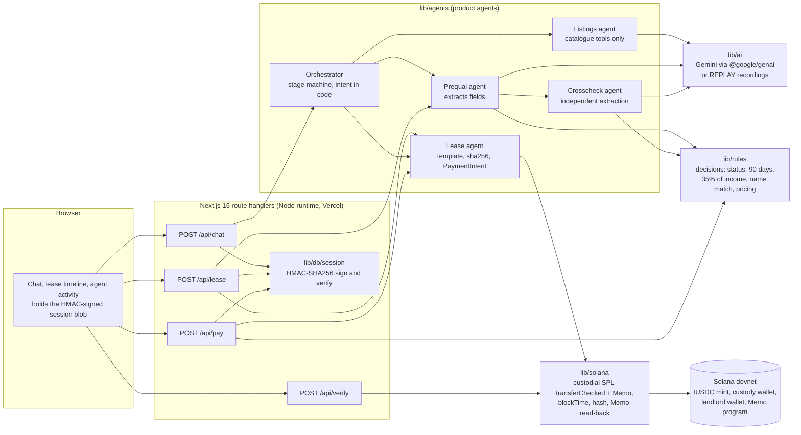
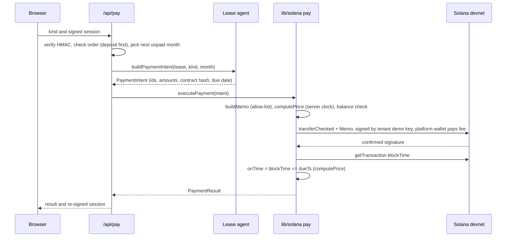
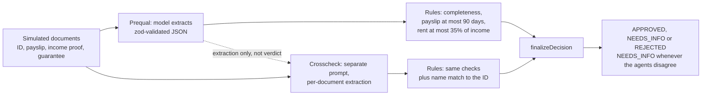

# Architecture

State at 2026-10-04: custodial escrow on Solana devnet, simulated data. Sections marked **Not on `main`** describe work that is either built on a branch (not merged, not deployed) or only planned; each says which. Decisions that shaped this are in `docs/03-architecture-decisions.md` (AD-01 to AD-15); the shared types are in `lib/contracts.ts`.

## 1. Components

| Layer | Path | Responsibility |
|---|---|---|
| UI | `app/`, `components/` | Landing, chat, cards, timeline. Server Components by default; Client Components only for interactivity. No Solana library, key or model SDK is imported by any client component. |
| Routes | `app/api/{chat,lease,pay,verify}/route.ts` | Validate the body with zod, verify the session, call the agents or `lib/solana`, return the types in `lib/contracts.ts`. |
| Session | `lib/db/session.ts` | `signSession` and `verifySession`: HMAC-SHA256 over canonical JSON, keyed with `SESSION_SECRET`. A bad signature is a 401. |
| Agents | `lib/agents/*` | The orchestrator and four agents. They never import Solana libraries. |
| Decisions | `lib/rules/*` | Pure functions: prequal rules, crosscheck rules, name matching, pricing. Same input gives the same output; no model inside. |
| Model | `lib/ai/*` | One facade (`generateStructured`, `chatStep`), a Gemini provider, an optional Anthropic provider, replay store, retry with backoff, daily call cap. |
| Chain | `lib/solana/*` | Connection, server keypairs, `transferChecked` plus Memo in one transaction, `executePayment`, `readMemoHash`, sha256, explorer links. |

## 2. Request lifecycles

**Chat turn (`/api/chat`).** Rate-limit check, parse, verify the session (a different `tenantId` starts a new session), `runTurn(state, message)`. The orchestrator picks the stage handler, which may call the listings agent or `evaluateTenant`. The response carries the reply, the stage, UI cards and a freshly signed session.

**Lease (`/api/lease`).** Verify the session. Re-run `evaluateTenant` for the selected tenant and property rent. Anything other than `APPROVED` returns 409 with the decision. Otherwise `createLeaseDraft` builds the contract text and its sha256 and the session moves to `PAYMENT`.

**Payment (`/api/pay`).** The body is only `{ kind, session }`.

**Verify (`/api/verify`).** Public and session-less. sha256 of the contract text is compared with the trailing hash of the lease Memo in the given transaction. `match` is false if the transaction or Memo is missing.

## 3. Pre-qualification pipeline

Outcomes for the three demo tenants: Ana `APPROVED`; Bruno `NEEDS_INFO` (`expired_payslip`, decided by prequal); Carla prequal `APPROVED`, final `NEEDS_INFO` (`name_mismatch`, decided by crosscheck).

## 4. AI modes and replay

| Mode | When | Behaviour |
|---|---|---|
| replay | `REPLAY=1`, or no API key for the selected provider, or `AI_DAILY_CALL_CAP` reached for the UTC day | Serve the recording for the key (agent id + input). No model call. A missing recording raises `ReplayMissError`; the listings agent then falls back to deterministic catalogue answers. |
| live | otherwise | Gemini with retry on 429 and 5xx. If it still fails and a recording exists, serve it. |
| record | `RECORD=1` | Live calls are written to `evals/recordings`. Evals use `AI_STRICT_LIVE=1`, which disables the fallback. |

Production runs in replay mode. Recordings are bundled through a generated static index so they work on serverless without file access.

## 5. Trust boundaries

| Boundary | What crosses it | What protects it |
|---|---|---|
| Browser to server | The signed session blob and a chat message or `kind` | HMAC signature; server recomputes approvals; amounts and payer come from the signed lease; zod validation on every body. |
| Documents to model | Text of simulated documents | Prompts treat it as untrusted data; tags are escaped; output is schema-constrained; the model has no tool that decides or moves funds. |
| Model to decision | Extracted fields | zod schema, then `lib/rules`. |
| Server to chain | One SPL transfer and one Memo per payment | `buildMemo` allow-list (opaque id, month, 64-hex hash); keys read only in server modules. |
| Chain to UI | Signature, `blockTime`, Memo | Explorer link; Verify recomputes the hash from the contract text. |

## 6. Custody model today

Custodial by construction. (`ESCROW_MODE=custodial` in `.env.example` is a placeholder; no code on `main` reads it.) The deposit goes from the tenant's demo token account to the platform custody wallet; rent goes to the landlord wallet; the platform wallet pays all fees. The server holds every keypair in environment variables. This is not trustless; see the README section "Custodial escrow on devnet, stated plainly".

## 7. Not on `main`: Anchor escrow (built and CI-tested on a branch, not deployed)

The program `rental_escrow` lives on branch `f3-anchor` with 69 of 69 integration tests and 6 of 6 cargo tests passing in CI there, an IDL and its own `docs/onchain.md`; the QA re-gate of the program code is GO. It is not merged into `main`, not deployed (the program id in the branch is a placeholder with no account on devnet) and not called by the app. The account and instruction table on that branch is authoritative; the intent below comes from `PLAN.md` and AD-03/AD-04.

- **Accounts (design intent):** `Lease` (tenant, landlord, agency pubkeys; mint; amounts; contract hash; due date; state) and `PaymentRecord` (lease, month, amount, `blockTime` from `Clock`, on-time flag). A PDA-owned vault token account holds the deposit.
- **Instructions:** the branch implements `vote_release` (a 2-of-3 vote among tenant, landlord and agency, the agency being the arbiter in disputes) and `cancel_lease`, among others; the earlier design note named `release_deposit`, which the branch does not use. See the IDL and `docs/onchain.md` there for the full list.
- **Release rule and custody:** with the demo server holding the landlord and agency keys, the escrow is custodial in substance; the program enforces 2-of-3 release and, without the tenant's vote, only after the full term or 10+ days of overdue rent.
- **Why:** it would remove the platform key from custody, make the on-time decision from the program's `Clock` instead of a server-side quote, and enforce one payment per slot on-chain, which would close the session-replay limitation. None of this is true of the deployed demo.
- **Fallback:** custodial is the only path on `main`. There is no switch: `ESCROW_MODE` in `.env.example` is a placeholder that no code reads. If the program is not merged and deployed by Thursday 08/10 at 12:00, the submission stays custodial.
- **Also on branches, not on `main`:** Solana Pay transaction request with a QR so the tenant signs from Phantom (behind a feature flag); persistence with a fallback when no database is configured (Drizzle, AD-11b; Neon is not provisioned) to replace the signed client-held session; an agency panel; real document upload; an ES/EN UI; and a Linux CI workflow, green on its branch.
